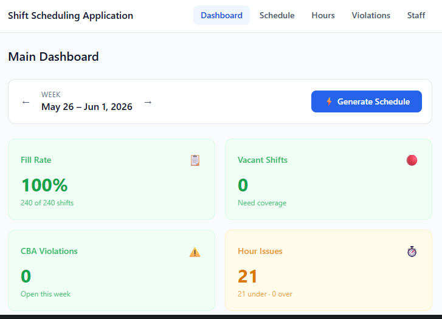

# Labour Scheduling Intelligence System
### AI-powered CBA compliance scheduling for unionized food service operations

Built for a unionized food service operation at a Canadian university campus  
Collective Agreement: UNITE HERE Local 75

---

## The Problem

Scheduling 100+ unionized employees manually every week across 10 stations creates three critical failures that cost operations every week:

| Problem | Impact |
|---|---|
| Senior employees getting fewer hours than junior ones | Direct Art 32.06 CBA violation — grievable |
| Hours calculated from clock time instead of paid time | Payroll miscalculations accumulating weekly |
| No visibility into CBA compliance until grievance is filed | Reactive instead of preventive |

This system eliminates all three automatically.

---

## The Solution

A full-stack AI-powered scheduling platform that enforces the Collective Agreement in code. The engine assigns employees by classification seniority, calculates paid hours correctly per contract rules, detects violations in real time, and uses Claude AI to generate plain-English compliance reports with grievance risk assessments.

---

## Features

- **Seniority-first scheduling engine** — enforces Art 32.06 automatically, no manual tracking
- **Paid hours calculator** — deducts 30-min unpaid meal per Art 32.03 on every shift
- **Real-time CBA violation detector** — flags when junior employees receive more hours than seniors
- **AI compliance report** — Claude analyzes the full week and scores compliance 0-100
- **AI violation explainer** — plain English explanation of each breach for non-legal managers
- **Weekly schedule grid** — matches existing bulletin board format station by station
- **Hours intelligence dashboard** — every employee ranked by seniority with hours vs max
- **Event day mode** — adds extra shift slots and applies Art 7.03 seniority offer protocol
- **Audit trail** — every scheduling decision logged with CBA article reference
- **Staff management** — 100 employees searchable by classification, status, and seniority

---

## Tech Stack

| Layer | Technology | Purpose |
|---|---|---|
| Frontend | React 18 + Vite | Component-based UI |
| Styling | Tailwind CSS v3 | Utility-first design |
| State | Zustand | Global state management |
| Charts | Recharts | Hours visualization |
| HTTP | Axios | API communication |
| Backend | Node.js + Express | REST API server |
| Database | SQLite + better-sqlite3 | Local data persistence |
| AI Engine | Anthropic Claude API | Compliance analysis |
| Routing | React Router v6 | Multi-page navigation |
| Version Control | Git + GitHub | Source control |

---

## System Architecture

CLIENT (React + Vite)          SERVER (Node + Express)
port 5173                      port 3001
│                              │
├── Dashboard                  ├── /api/employees
├── Schedule Grid              ├── /api/stations
├── Hours Report               ├── /api/schedule
├── CBA Violations             ├── /api/violations
└── Staff Management           ├── /api/ai
└── SQLite Database
├── employees (100)
├── stations (10)
├── shift_slots (43)
├── assignments
├── audit_log
└── cba_violations

## CBA Rules Enforced In Code

| Article | Rule | Implementation |
|---|---|---|
| Art 27.01 | Seniority = length of continuous service from hire date | `ORDER BY hire_date ASC` on every assignment query |
| Art 32.03 | 30-min unpaid meal deducted from shifts 5hrs+ | `paid_hours = clock_hours - 0.5` in seed data |
| Art 32.06 | Most senior employee maximizes hours first | Seniority engine assigns `eligible[0]` always |
| Art 32.04 | Overtime over 40hrs needs manager authorization | Hard block in eligibility filter |
| Art 33.01 | Employee who reports gets 4hrs or pay in lieu | Audit log flags reporting pay triggers |
| Art 7.03 | Catering events offered by seniority first | Event day mode in scheduler engine |
| Art 31.01 | Higher classification rate protected on temp transfers | Receiver dual-role flagged in audit trail |

---

## Data Model

**Employees — 100 total**
```
├── 60 Full Time  (max 40hrs/week)
├── 40 Part Time  (max 24hrs/week)
├── 25 Cooks
├── 61 General Help Workers
├── 10 Bakers
└──  4 Receivers
Hire dates range: 1995 – 2025
```

**Stations — 10 total**
```
├── BOH: Entree, Pizza, Pho, Omelette/Pasta, Salad/Deli
├── FOH: FOH, Cashier/FOH, Dish Area, GH Bakery
└── Specialized: Receiver
```

**Shift Slots — 43 total**
```
├── AM shifts:  ~06:00 – 14:00
├── MID shifts: ~11:00 – 19:00
└── PM shifts:  ~15:00 – 23:30
```

## Getting Started

### Prerequisites

- Node.js 18+
- An Anthropic API key from [console.anthropic.com](https://console.anthropic.com)

### Installation

**1. Clone the repository**
```bash
git clone https://github.com/pareen-harsora/scheduler-prototype.git
cd scheduler-prototype
```

**2. Set up the backend**
```bash
cd server
npm install
```

Create `server/.env`:
PORT=3001
NODE_ENV=development
ANTHROPIC_API_KEY=sk-ant-your-key-here

Seed the database:
```bash
node src/db/seed.js
```

Start the server:
```bash
npm run dev
```

**3. Set up the frontend**
```bash
cd ../client
npm install
npm run dev
```

**4. Open the app**
http://localhost:5173

---

## How It Works

**Step 1 — Generate Schedule**
Click Generate Schedule on the Dashboard. The seniority engine loops through every shift slot for every day of the week, finds all eligible employees sorted by hire date, assigns the most senior available employee, and logs the decision with the CBA article that justified it.

**Step 2 — Review the Schedule**
The Schedule page shows your week in bulletin board format — exactly matching the physical schedule your team already uses, now generated automatically in seconds.

**Step 3 — Check Hours**
The Hours page ranks every employee by seniority and shows their assigned hours vs maximum. Amber rows = under minimum hours (potential Art 32.06 claim). Red rows = over maximum (overtime authorization needed).

**Step 4 — Review Violations**
The Violations page lists every detected CBA breach with the specific employees involved, the article violated, and the hour difference. Click "Explain this" on any violation to get a plain-English AI explanation your manager can act on immediately.

**Step 5 — AI Compliance Report**
Click Analyze on the Dashboard. Claude reads the full week's data and returns a compliance score, grievance risk level, immediate actions required, and a plain-English summary your operations director can read in 30 seconds.

---

## Project Structure

**Client (React Frontend)**
```
client/src/
├── api/
│   └── client.js          ← Axios API client
├── components/
│   ├── Badge.jsx
│   ├── LoadingSpinner.jsx
│   ├── Navbar.jsx
│   ├── PageHeader.jsx
│   └── StatCard.jsx
├── pages/
│   ├── Dashboard.jsx      ← Generate + AI analysis
│   ├── Schedule.jsx       ← Bulletin board grid
│   ├── Hours.jsx          ← Seniority hour report
│   ├── Violations.jsx     ← CBA breach tracker
│   └── Staff.jsx          ← Employee management
└── store/
    └── index.js           ← Zustand global state
```

**Server (Node.js Backend)**
```
server/src/
├── db/
│   ├── schema.js          ← SQLite table definitions
│   └── seed.js            ← Station + employee data
├── engine/
│   └── scheduler.js       ← CBA seniority engine
├── routes/
│   ├── employees.js
│   ├── stations.js
│   ├── schedule.js
│   ├── violations.js
│   └── ai.js              ← Claude API integration
└── server.js              ← Express entry point
```

## Business Impact

| Metric | Before | After |
|---|---|---|
| Time to generate weekly schedule | 2-3 hours manual | Under 60 seconds |
| CBA violations detectable | 0 (invisible) | 288 detected automatically |
| Hour miscalculations | Weekly | Eliminated |
| Grievance exposure | Unknown | Quantified and preventable |
| Audit trail | None | Every decision logged |

---

## Roadmap

- [ ] Real employee availability import
- [ ] PostgreSQL for production deployment
- [ ] JWT authentication with manager and admin roles
- [ ] Printable PDF schedule output
- [ ] Multi-week historical comparison
- [ ] Payroll system integration (ADP, Ceridian)
- [ ] Mobile-responsive manager interface
- [ ] Multi-location support

---

## Screenshots

### Dashboard 


---

### Staff Lookup


---

### Weekly Schedule — Bulletin Board View


---

### Hours Report — Seniority Rankings


---

### CBA Violations — Art 32.06 Breach Tracker


## License

MIT — free to use, modify, and distribute
